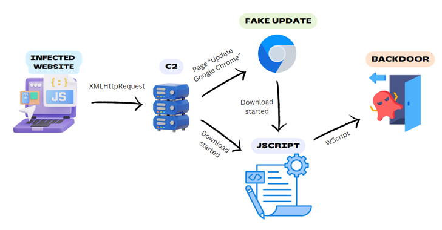

# PwnOverWifi, GravityRAT, BadSpace, iconv

### Technical Summary
CVE-2024-6044 and CVE-2024-6045 Vulnerabilities in D-Link EAGLE PRO AI and AQUILA PRO AI Devices

Two critical vulnerabilities, CVE-2024-6044 and CVE-2024-6045, have been identified in the D-Link EAGLE PRO AI and AQUILA PRO AI device families. These vulnerabilities allow for LAN-side arbitrary file reading and elevated unauthenticated access.

BadSpace Malware Delivered via Compromised Websites

BadSpace is a Windows backdoor malware distributed through compromised websites masquerading as fake browser updates.

GravityRAT and HeavyLift Malware Threat Analysis

GravityRAT, a remote access trojan, has evolved to include Android targeting capabilities and integrates with HeavyLift, an Electron-based malware loader.

Critical Vulnerability in PHP - CVE-2024-2961

CVE-2024-2961 is a critical vulnerability in PHP's iconv() function, which can be exploited through various means including the symfony/polyfill-mbstring library.

Forest Compromise Through AMA Abuse

Forest compromise through AMA (Azure Monitor Agent) abuse involves exploiting misconfigurations and vulnerabilities in Azure environments.

Critical Security Updates for Microsoft

Microsoft has released critical security updates to address multiple vulnerabilities across various products.

### 🚨 Vulnerability of the Week
Microsoft has identified a critical vulnerability in the Wi-Fi driver, designated CVE-2024-30078, with a severity rating of 8.8. This vulnerability has not been publicly disclosed, nor has it been observed in active attacks. However, its exploitation is deemed "less likely" according to Microsoft.

An unauthenticated attacker could exploit this vulnerability by sending a malicious networking packet to an adjacent system using a Wi-Fi networking adapter. Successful exploitation could lead to remote code execution, allowing the attacker to run malware or spyware on the victim's computer without any physical interaction or authentication.

This flaw affects every supported version of Windows and poses a significant risk as it allows remote code execution on nearby Windows PCs via their Wi-Fi connections. This makes it particularly attractive to attackers and security researchers alike.

### 🥵 Malware or Ransomware

GravityRAT, initially disclosed by Talos in 2018, is a Windows-based remote access trojan (RAT) that has since evolved to target Android devices by 2019. Its development and enhancement over the years have been continuous, with new capabilities being added regularly. This RAT has been primarily used by suspected Pakistani threat actors to target Indian entities and individuals, with no evidence suggesting it is a commodity or open-source malware. This exclusivity points to its likely use by a specific group of threat actors, possibly tied to state-sponsored activities.

Our comprehensive analysis of Operation Celestial Force indicates that GravityRAT has been active since 2016, targeting victims through various means, including malicious websites masquerading as legitimate Android applications. These websites, some of which were registered as recently as January 2024, distribute the malware through download links shared on social media channels. Upon installation, the trojan registers the infected device with a command-and-control (C2) server, concealing its true location using Cloudflare services. GravityRAT's evolving capabilities include sending detailed device information to the C2, reading and uploading SMS data, call logs, specific file formats, and even deleting contacts and logs to cover its tracks.

In parallel, the operation also utilizes an Electron-based malware loader known as HeavyLift. This loader acts as a stage-one malware component, downloading and installing additional malicious implants from the same C2 servers that control GravityRAT. HeavyLift is introduced through executables disguised as legitimate application installers. It conducts preliminary system checks and, depending on the operating system (macOS or Windows), sets specific HTTP User-Agents and collects system information. On macOS, it leverages osascript for privilege escalation, while on Windows, it creates scheduled tasks for persistence.

HeavyLift employs various anti-analysis techniques, including checks for virtual environments and specific keywords associated with virtualization software. If detected, the malware ceases operation to avoid analysis. This sophisticated approach underscores the advanced nature of the threat actors behind these campaigns. Both GravityRAT and HeavyLift highlight the necessity for robust security measures, including up-to-date anti-malware tools, user education on phishing and social engineering tactics, and rigorous monitoring of network traffic for suspicious activities.

### 🟥 1Day

CVE-2024-2961 is a critical vulnerability affecting the iconv() function in PHP, a widely-used programming language for web development. This vulnerability not only impacts iconv() but also potentially its sibling functions, and a popular PHP extension called mbstring. The vulnerability has significant implications for web applications and frameworks that rely on these functions and extensions.

Direct Calls to iconv()

The iconv() function, used for character set conversion, is directly exploitable. This function is essential for many web applications that handle various character encodings.

Sibling Functions

Functions related to iconv(), such as iconv_strrpos(), iconv_substr(), and others, may also be vulnerable. These functions should be reviewed for potential security issues.

mbstring Extension

The mbstring extension, written in C, allows manipulation of strings under various charsets and performs character set conversions. It is widely used in many frameworks and CMSes.

symfony/polyfill-mbstring Project When mbstring is not installed (which requires superuser rights), developers can use the symfony/polyfill-mbstring project. This project mimics the mbstring API using PHP and relies on iconv() for character set conversion. This makes applications using symfony/polyfill-mbstring vulnerable to CVE-2024-2961.

### 🕯️ The Topic of the Week

Cybersecurity researchers have uncovered a malicious campaign leveraging legitimate-but-compromised websites to distribute a Windows backdoor known as BadSpace under the guise of fake browser updates. According to German cybersecurity firm G DATA, the threat actor behind this campaign uses a multi-stage attack chain that includes an infected website, a command-and-control (C2) server, fake browser update prompts, and a JScript downloader to deploy the backdoor onto victims' systems.

The attack begins with a compromised website, often built on platforms such as WordPress, where injected code determines if a user is visiting for the first time. Upon a first-time visit, the injected code collects device information, IP address, user-agent, and location, and transmits this data to a hard-coded domain through an HTTP GET request. If the server detects a new user, it responds by overlaying the webpage with a fake Google Chrome update pop-up window. This pop-up either directly drops the malware or deploys a JavaScript downloader that subsequently installs BadSpace.

Detailed analysis of the C2 servers linked to this campaign reveals connections to SocGholish (also known as FakeUpdates), a well-known JavaScript-based downloader malware. SocGholish shares a similar propagation mechanism, further linking the two campaigns. BadSpace itself is equipped with several sophisticated features: it performs anti-sandbox checks, establishes persistence using scheduled tasks, and is capable of harvesting system information. The malware can also process commands to take screenshots, execute instructions via cmd.exe, read and write files, and delete the scheduled task to evade detection.

This campaign underscores the importance of maintaining robust security practices, especially on websites vulnerable to compromise. Organizations and individuals are advised to keep their web platforms up to date, use security plugins, and regularly scan for vulnerabilities. Users should be cautious of unexpected browser update prompts and verify updates through official channels. Implementing multi-layered security solutions and conducting regular security awareness training can help mitigate the risks posed by threats like BadSpace.